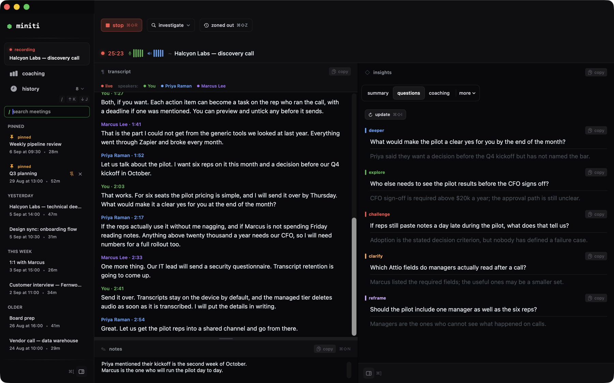
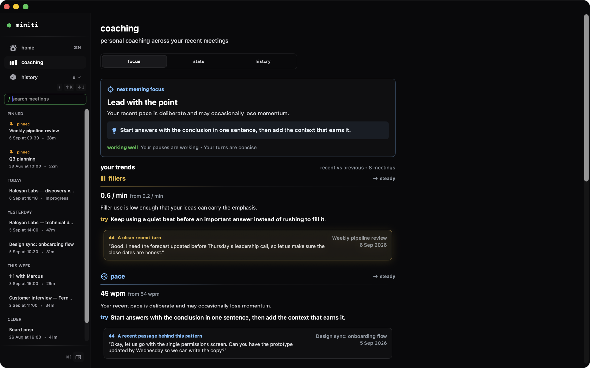

# miniti for Linux

**your meetings know more than you.**

most meeting tools stop at notes.
notes and AI summaries are table stakes.
miniti transcribes every meeting live and surfaces the questions worth asking while they can still be asked.
it coaches you to speak with clarity and confidence.
your transcripts and insights stay on your machine, and you own them forever.

this is the native Linux app, built with Tauri 2 and Rust.
same backend, same insights, same meeting data as the Mac app.
a Linux desk gets everything a Mac desk gets.



<sub>the meeting view (captured on macOS; the Linux app uses the same layout)</sub>

- 🌐 [website](https://miniti.app)
- 📖 [documentation](https://miniti.app/docs)
- 📝 [changelog for every platform](https://miniti.app/changelog) · this app's own [CHANGELOG.md](CHANGELOG.md)
- 📦 [releases](https://github.com/12ian34/miniti-linux/releases)
- 💬 [issues and ideas](https://github.com/12ian34/miniti-linux/issues)

## what miniti does

- 🎙️ **live transcript** in 11 languages, with remote callers and the people in the room kept apart as separate speakers, and names inferred from the conversation and your calendar
- 💡 **insights while you talk**: a rolling summary, the open questions worth asking next, and coaching on fillers, pace, talk ratio, monologue length and clarity
- 🎯 **specialist views** when you need them: Sales for live MEDDPICC analysis with CRM sync to Attio or Twenty, Playbook for cited answers from your own docs
- ⏪ **catch me up** when you zoned out, and **investigate** a question on the web or in a local codebase without leaving the call
- 📈 **coaching over time**: your speaking stats across meetings, with one practical focus for the next one
- 📅 **smart meetings**: notices when a call may have ended or the next one is about to start, with Google Calendar auto-start and auto-stop
- 🔒 **your data, your tools**: local history, Markdown export, webhooks to Zapier, Make or n8n, Granola import



## install

prebuilt x86_64 releases are built on Ubuntu 22.04 (glibc 2.35), so they run on
Ubuntu 22.04+, Debian 12+, Fedora, Arch and other rolling distributions.

**Arch Linux.** Build the package from the PKGBUILD in this repo. It downloads
the release tarball, verifies its checksum and installs through pacman. The
same package will be published on the AUR as `miniti-bin` once AUR
registration reopens.

```bash
git clone https://github.com/12ian34/miniti-linux.git
cd miniti-linux/packaging/aur/miniti-bin
makepkg -si
```

**Omarchy.** It is Arch underneath, so the Arch package above is the one to use
(and `yay -S miniti-bin` once the AUR listing is live). PipeWire is already
there. Omarchy runs Hyprland, a Wayland compositor, so the floating recording
surface may not appear where miniti asks; the tray timer and notifications are
unaffected. If you see anything Omarchy-specific,
[open an issue](https://github.com/12ian34/miniti-linux/issues).

**Debian / Ubuntu.** Download `miniti_<version>_amd64.deb` from the
[latest release](https://github.com/12ian34/miniti-linux/releases/latest), then:

```bash
sudo apt install ./miniti_*_amd64.deb
```

**Any distribution.** Download the tarball from the latest release, then:

```bash
tar xzf miniti-*-x86_64-unknown-linux-gnu.tar.gz && cd miniti-*-x86_64-unknown-linux-gnu
install -Dm755 miniti ~/.local/bin/miniti
install -Dm644 miniti.desktop ~/.local/share/applications/miniti.desktop
cp -r icons/hicolor/* ~/.local/share/icons/hicolor/
miniti
```

Runtime libraries (Arch names; the tarball's own README lists the Debian names):
`webkit2gtk-4.1 gtk3 libsoup3 librsvg libappindicator-gtk3 openssl pipewire
pipewire-pulse libpulse libsecret libnotify`. A secret service such as
`gnome-keyring` is optional: without one, credentials are kept in
`~/.local/share/miniti/auth.json` with mode 0600. On Wayland, installing
`gtk-layer-shell` lets the floating recording surface pin itself to the corner
on compositors that support it (Hyprland, Sway, KDE); without it, or on GNOME,
the compositor decides where the surface appears.

### first launch

Choose how miniti should run:

- **Managed** uses the miniti backend. Your account is an anonymous recovery
  key created in the app, with no email or password. 500 free minutes every
  month; Pro is a Polar subscription. Keep the recovery key somewhere safe: it
  is the only way to restore your account on another computer.
- **BYOK** uses your own Deepgram and OpenAI API keys and never talks to the
  miniti backend.

System audio for remote callers needs PipeWire with the pulse shim
(`pipewire-pulse`). Without it miniti transcribes the microphone only.

Updates come through your package manager or the releases page. The app
checks the minimum supported version on launch but does not update itself.

## what is in the Linux app

miniti for Linux follows the Mac app feature for feature wherever Linux allows
it.

| Area | Linux | Notes |
| --- | --- | --- |
| Live transcription (Deepgram Nova-3, speaker separation, echo reconciliation) | Yes | Microphone plus system audio through PipeWire |
| Live insights: Summary, Questions, Coaching, Sales (MEDDPICC), Playbook (Docs MCP) | Yes | Same cadence and prompts as macOS |
| Catch me up, Investigate (web and codebase), automatic speaker naming | Yes | |
| History: search, pin, rename speakers, mark as you, trim, delete, notes | Yes | |
| Export: Markdown, copy transcript, webhooks, Granola CSV import | Yes | |
| Google Calendar, Attio, Twenty | Yes | OAuth completes in the browser and returns through a `miniti-*` URL scheme |
| Smart meetings (quiet prompts, calendar handoff, call detection) | Yes | Call detection is PipeWire-client based; browsers are a weaker signal than native apps |
| Tray icon with timer, floating recording surface, desktop notifications | Yes | Surface never takes focus; on Wayland it pins itself via layer-shell where supported (Hyprland, Sway, KDE), GNOME decides placement |
| Pro via Polar, license-key restore, BYOK, usage banner and limit view | Yes | |
| Interface scale (compact / standard / large), debug log viewer | Yes | |
| Coaching charts and grounded examples | Yes | Trend chart per metric; clickable passages from recent meetings |
| Templates view (BANT, SPIN, interview, check-in, stand-up, 1:1) | Yes | Live, on demand, on saved meetings; in exports and webhooks |
| Silent in-app updates | No | Package manager or releases page instead |
| iOS companion, Apple subscriptions, Sparkle | No | Apple-only by nature |

Known limits and verification status are tracked in [AGENTS.md](AGENTS.md) § Status.

## develop and run locally

Prerequisites (Debian/Ubuntu package names):

- Rust **stable** (≥ 1.85, enforced by `rust-version` in Cargo.toml)
- Node 22 + `pnpm`
- System libs: `libwebkit2gtk-4.1-dev libgtk-3-dev libsoup-3.0-dev librsvg2-dev
  libjavascriptcoregtk-4.1-dev libayatana-appindicator3-dev libssl-dev
  libpipewire-0.3-dev libpulse-dev libsecret-1-dev build-essential`

```bash
pnpm install            # frontend deps
pnpm tauri dev          # run the desktop app (starts Vite + the Rust shell)

pnpm build              # typecheck + build the web frontend only
cargo test --manifest-path src-tauri/Cargo.toml   # Rust unit tests
pnpm tauri build        # release binary + .deb bundle
```

Debug logging: `RUST_LOG=debug pnpm tauri dev`. Headless machines can run the
app under a virtual display:

```bash
Xvfb :99 -screen 0 1280x800x24 &
DISPLAY=:99 WEBKIT_DISABLE_DMABUF_RENDERER=1 dbus-run-session -- pnpm tauri dev
```

### no secrets in the binary

Nothing is baked into a build. On the first managed-mode launch the app creates
(or restores) an anonymous recovery key and a per-device P-256 installation
key; the backend then issues short-lived, device-bound tokens (see the miniti
API reference, "Device-bound client authorization"). Credentials live in the
desktop secret service (`com.miniti.linux` / `device-auth`), or in
`~/.local/share/miniti/auth.json` (0600) when no secret service is running. Any
build, from source or CI, can use managed mode.

## release

Releases are cut by pushing a `v*` tag. CI builds on Ubuntu 22.04 (the glibc
2.35 baseline) and publishes the tarball, its checksum and the `.deb` to a
GitHub Release. Then update `pkgver` and `sha256sums` in `packaging/aur/*`, add
the entry to [CHANGELOG.md](CHANGELOG.md), and push the AUR package. Details
in [docs/distribution.md](docs/distribution.md).

```bash
pnpm tauri build                 # local equivalent: binary + .deb
packaging/make-tarball.sh        # -> dist-release/miniti-<ver>-x86_64-unknown-linux-gnu.tar.gz
```

## license

Elastic License 2.0 (see `LICENSE`): use, modify and redistribute freely, but you
may not offer miniti as a hosted or managed service, remove the notices, or
circumvent the Pro entitlement checks.
